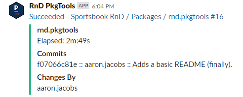

## An Introduction

I'm Aaron Jacobs, a Data Scientist at Crescendo Technology in Toronto.

We work on the technology side of sports betting, and were originally part of
[Pinnacle](https://www.pinnacle.com) --- "the largest sportsbook you've never
heard of."

[R is used widely across Pinnacle](https://resources.rstudio.com/rstudio-conf-2018/training-an-army-of-new-data-scientists-marco-blume),
but especially in my home department, Sportsbook "RnD".

I help maintain **more than 50 internal R packages** for RnD, and wrote a lot of
the R tooling we use to make that possible.

I blog at `unconj.ca` and tweet from `@unconj1`.

## What This Talk is Not

I am not going to cover how to write R packages.

If you're interested in "getting started with" material, there are loads of
great resources out there:

- Hadley Wickham's [*R Packages*](http://r-pkgs.had.co.nz/) is still the best
  reference book.
- R's own documentation, ['Writing R Extensions'](https://cran.r-project.org/doc/manuals/r-release/R-exts.html)
  is also handy, but much heavier going.
- The **usethis** package automates most of the setup.
- There are many talks on YouTube and slides on Slideshare if you go looking.

## The Actual Subject

Most resources for R package authors are pitched at those writing open-source
packages --- usually hosted on [GitHub](https://github.com), and with the goal
of ending up on [CRAN](https://r-project.org).

This is great! But it's not the whole story. Many of you will be writing
packages for **internal use** within your company or organization.

And yet there is comparatively little out there about how to develop
high-quality packages for these environments.

This is my attempt to address that gap.

I'll focus on three major themes: code, culture, and tooling.

# Proprietary Code 101

## Why Should You Write R Packages for Internal Use?

R packages are **the best way to share R code** and keep it well-maintained and
reliable. This matters even more inside an organization or when you are part of
a team.

Most tools to make your R code robust, portable, and well-documented are [only
available](https://unconj.ca/blog/why-there-is-no-importfrom-in-r.html) for use
with packages: `R CMD check`, `testthat`, and `roxygen` are all good examples.

I would push this further than most, and suggest you put as much R code as you
can get away with inside packages.

Including Shiny apps! And models! And ETL!

# ~~Copy + Paste~~ Internal Packages

## What Can Internal Packages Contain?

Functions that I've seen generally fall into a small number of categories.

All of the examples below are *real* functions from our own packages.

- Tools for making data easy to access and use correctly.

```r
pull_data(...)
mongo_collection(...)
```

- Themes and other internal conventions.

```r
theme_pinnacle(...)
pinnacle_presentation(...)
```

---

- Business logic; and

```r
vig_cents_to_percent(...)
get_clp_est(..)
```

- Encoding process.

```r
send_to_slack(...)
rnd_release(...)
```

There could be other good candidates. As I mentioned, we put models, Shiny
applications, and ETL in packages when possible.

# The Two Cultures

## CRAN/FOSS: Authorship

Most CRAN packages are written by someone trying to scratch an itch.

The expectation is that this individual will (1) design the APIs; (2) write the
code; and (3) maintain the package.

This person will **make the major decisions** about where the package goes and
**be the authority** on why code works the way it does.

This person unconsciously acts as though they will maintain the code forever
(or more likely: until the package is abandoned).

I call this an **Authorship** paradigm.

## Proprietary: Maintainership

Things are dramatically different for proprietary code:

- You likely inherited a codebase you did not design, and it is your **job** to
  maintain it, to understand it, and to be the person to ask about bugs and new
  features.
- You will not maintain new code you have designed/written forever. At some
  point it will likely be someone else's job.
  
I call this a **Maintainership** paradigm.

So what does this imply about writing R packages? Well, you should write the
kind of R code you'd like to maintain.

## What Kind of R Package Would You Like to Maintain?

This is not a trick question. You want to see

- Clear R source code with helpful comments.
- Good documentation, with clear explanations and examples, and an overview of
  the main package features in a `README` file.
- A test suite, both as additional examples and also to help prevent you from
  introducing regressions.
- A documented history: an up-to-date `NEWS` file and clear git commit history.

In other words, pretty much all of the usual advice.

# Proprietary Tooling

## Downside: You Can't Always Pick Your Tools

Unlike the CRAN/FOSS world, in an organization you'll have limited power to
choose the tools your organization (already) uses for collaboration and
development.

And, unless you've got a compelling reason, you **should** adopt your
organization's existing tools.



(E.g. at Crescendo we use Stash, JIRA, and TeamCity.)

## Upside: Shared Tooling Brings Opportunities

Because everyone is required to use the same tools, you can sometimes turn this
to your advantage.

For example, tools can create data (e.g. releases, downloads, commit activity,
email messages, Slack messages) that can be analyzed to help you measure and
understand activity or problems, since you know they represent the whole picture.

---

You can also leverage a shared tool for opportunities you might not otherwise
have:


# Coda: Licensing

## Copyright in Proprietary Packages: The Right Way

If your package is not open source, do not pretend that it is:

1. Put `License: file LICENSE` in your `DESCRIPTION` file; and
2. Put `Copyright <my company> <year>. All rights reserved.` in a `LICENSE` file.

(This is a pet peeve of mine --- I have [a blog post](https://unconj.ca/blog/copyright-in-closed-source-r-packages-the-right-way.html)
expanding on why this is the only correct way if you are interested.)

ps. If you copy & paste code from CRAN packages into your organization's
codebase, please make an effort to include its copyright notice and abide by its
license.

## Questions?
