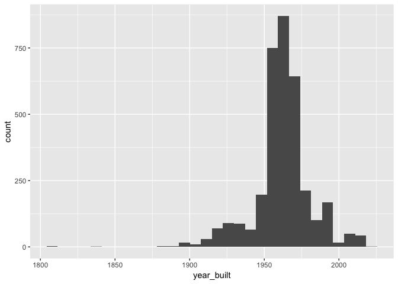
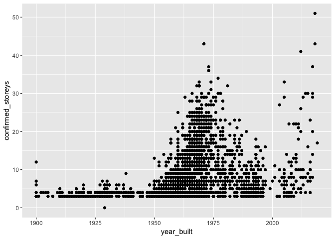
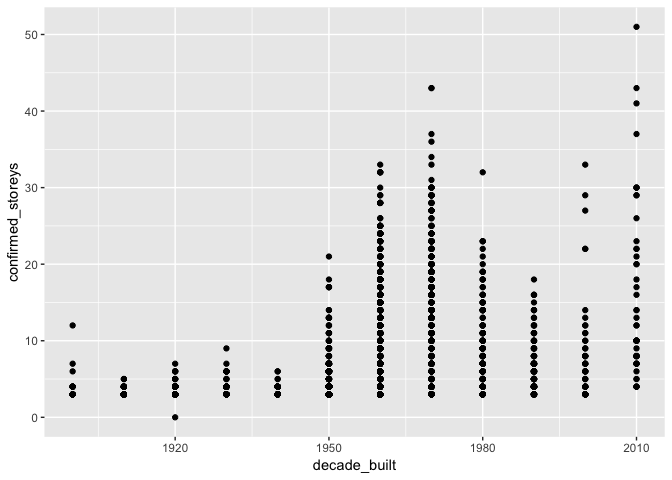
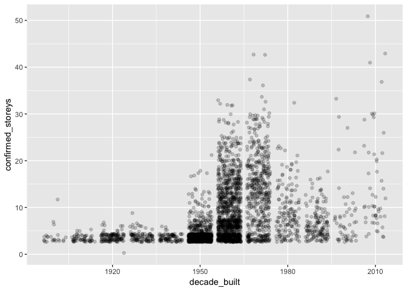
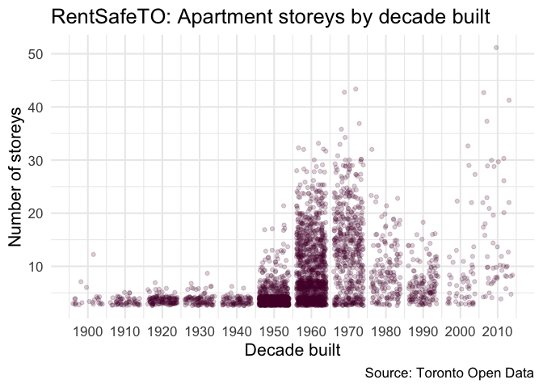

Toronto Open Data Demo
================

<http://bit.ly/opendatatoronto-demo>

# Toronto Open Data

<https://open.toronto.ca/>

Data around Toronto’s population, infrastructure, services, etc.

Let’s read in the data…

``` r
# <find the data and read it in>
```

# `opendatatoronto`

There is a growing demand for open data and increased momentum in
Toronto’s civic spaces.

Demand for more data and more functionality.

<https://sharlagelfand.github.io/opendatatoronto/>

``` r
# install.packages("devtools") # if you don't have devtools
# devtools::install_github("sharlagelfand/opendatatoronto")
```

## Look at the data set

In the portal, data sets are called packages. Yes I know.

``` r
library(opendatatoronto)

# <show the package metadata>
show_package("https://open.toronto.ca/dataset/apartment-building-evaluation/")
```

    ## # A tibble: 1 x 10
    ##   title id    topics civic_issues excerpt dataset_category num_resources
    ##   <chr> <chr> <chr>  <chr>        <chr>   <chr>                    <int>
    ## 1 Apar… 4ef8… Locat… <NA>         This d… Table                        1
    ## # … with 3 more variables: formats <chr>, refresh_rate <chr>,
    ## #   last_refreshed <date>

The actual datasets are called resources:

``` r
# <show the resurces available in the package>
list_package_resources("https://open.toronto.ca/dataset/apartment-building-evaluation/")
```

    ## # A tibble: 1 x 4
    ##   name                    id                           format last_modified
    ##   <chr>                   <chr>                        <chr>  <date>       
    ## 1 Apartment Building Eva… b987be09-0c62-4d7d-928c-4a1… CSV    NA

## Get the data

You can get the resource directly in R, without having to download it
first\!

``` r
apartments <- # <get the resource directly into R>
  list_package_resources("https://open.toronto.ca/dataset/apartment-building-evaluation/") %>%
  get_resource()

apartments
```

    ## # A tibble: 3,446 x 32
    ##    `_id` BALCONY_GUARDS CONFIRMED_STORE… CONFIRMED_UNITS ELEVATORS
    ##    <int> <chr>                     <int>           <int> <chr>    
    ##  1     1 N/A                          28             457 4        
    ##  2     2 N/A                           4              15 N/A      
    ##  3     3 N/A                           3              26 N/A      
    ##  4     4 N/A                           3              10 N/A      
    ##  5     5 5                            29             272 5        
    ##  6     6 N/A                           3              12 N/A      
    ##  7     7 5                             7              95 5        
    ##  8     8 3                            18             287 4        
    ##  9     9 4                            17             327 5        
    ## 10    10 4                            32             565 4        
    ## # … with 3,436 more rows, and 27 more variables:
    ## #   ENTRANCE_DOORS_WINDOWS <chr>, ENTRANCE_LOBBY <chr>,
    ## #   EVALUATION_COMPLETED_ON <chr>, EXTERIOR_CLADDING <chr>,
    ## #   EXTERIOR_GROUNDS <chr>, EXTERIOR_WALKWAYS <chr>,
    ## #   GARBAGE_BIN_STORAGE_AREA <chr>, GARBAGE_CHUTE_ROOMS <chr>,
    ## #   GRAFFITI <chr>, INTERIOR_LIGHTING_LEVELS <chr>,
    ## #   INTERIOR_WALL_CEILING_FLOOR <chr>, INTERNAL_GUARDS_HANDRAILS <chr>,
    ## #   NO_OF_AREAS_EVALUATED <chr>, OTHER_FACILITIES <chr>,
    ## #   PARKING_AREA <chr>, PROPERTY_TYPE <chr>, RESULTS_OF_SCORE <chr>,
    ## #   RSN <int>, SCORE <chr>, SECURITY <chr>, SITE_ADDRESS <chr>,
    ## #   STAIRWELLS <chr>, STORAGE_AREAS_LOCKERS <chr>, WARD <chr>,
    ## #   WATER_PEN_EXT_BLDG_ELEMENTS <chr>, YEAR_BUILT <chr>,
    ## #   YEAR_REGISTERED <chr>

## Clean the data

The data’s variable names are annoying to work with.

``` r
names(apartments)
```

    ##  [1] "_id"                         "BALCONY_GUARDS"             
    ##  [3] "CONFIRMED_STOREYS"           "CONFIRMED_UNITS"            
    ##  [5] "ELEVATORS"                   "ENTRANCE_DOORS_WINDOWS"     
    ##  [7] "ENTRANCE_LOBBY"              "EVALUATION_COMPLETED_ON"    
    ##  [9] "EXTERIOR_CLADDING"           "EXTERIOR_GROUNDS"           
    ## [11] "EXTERIOR_WALKWAYS"           "GARBAGE_BIN_STORAGE_AREA"   
    ## [13] "GARBAGE_CHUTE_ROOMS"         "GRAFFITI"                   
    ## [15] "INTERIOR_LIGHTING_LEVELS"    "INTERIOR_WALL_CEILING_FLOOR"
    ## [17] "INTERNAL_GUARDS_HANDRAILS"   "NO_OF_AREAS_EVALUATED"      
    ## [19] "OTHER_FACILITIES"            "PARKING_AREA"               
    ## [21] "PROPERTY_TYPE"               "RESULTS_OF_SCORE"           
    ## [23] "RSN"                         "SCORE"                      
    ## [25] "SECURITY"                    "SITE_ADDRESS"               
    ## [27] "STAIRWELLS"                  "STORAGE_AREAS_LOCKERS"      
    ## [29] "WARD"                        "WATER_PEN_EXT_BLDG_ELEMENTS"
    ## [31] "YEAR_BUILT"                  "YEAR_REGISTERED"

``` r
library(janitor)

apartments <- apartments %>%
  # <function for cleaning the data's names>
  clean_names()

names(apartments)
```

    ##  [1] "id"                          "balcony_guards"             
    ##  [3] "confirmed_storeys"           "confirmed_units"            
    ##  [5] "elevators"                   "entrance_doors_windows"     
    ##  [7] "entrance_lobby"              "evaluation_completed_on"    
    ##  [9] "exterior_cladding"           "exterior_grounds"           
    ## [11] "exterior_walkways"           "garbage_bin_storage_area"   
    ## [13] "garbage_chute_rooms"         "graffiti"                   
    ## [15] "interior_lighting_levels"    "interior_wall_ceiling_floor"
    ## [17] "internal_guards_handrails"   "no_of_areas_evaluated"      
    ## [19] "other_facilities"            "parking_area"               
    ## [21] "property_type"               "results_of_score"           
    ## [23] "rsn"                         "score"                      
    ## [25] "security"                    "site_address"               
    ## [27] "stairwells"                  "storage_areas_lockers"      
    ## [29] "ward"                        "water_pen_ext_bldg_elements"
    ## [31] "year_built"                  "year_registered"

Missing values are “N/A”, not NA

Tedious to do it one by one…

``` r
library(dplyr)
```

    ## 
    ## Attaching package: 'dplyr'

    ## The following objects are masked from 'package:stats':
    ## 
    ##     filter, lag

    ## The following objects are masked from 'package:base':
    ## 
    ##     intersect, setdiff, setequal, union

``` r
apartments %>%
  mutate(balcony_guards = ifelse(balcony_guards == "N/A", NA, balcony_guards),
         confirmed_storeys = ifelse(confirmed_storeys == "N/A", NA, confirmed_storeys))
```

    ## # A tibble: 3,446 x 32
    ##       id balcony_guards confirmed_store… confirmed_units elevators
    ##    <int> <chr>                     <int>           <int> <chr>    
    ##  1     1 <NA>                         28             457 4        
    ##  2     2 <NA>                          4              15 N/A      
    ##  3     3 <NA>                          3              26 N/A      
    ##  4     4 <NA>                          3              10 N/A      
    ##  5     5 5                            29             272 5        
    ##  6     6 <NA>                          3              12 N/A      
    ##  7     7 5                             7              95 5        
    ##  8     8 3                            18             287 4        
    ##  9     9 4                            17             327 5        
    ## 10    10 4                            32             565 4        
    ## # … with 3,436 more rows, and 27 more variables:
    ## #   entrance_doors_windows <chr>, entrance_lobby <chr>,
    ## #   evaluation_completed_on <chr>, exterior_cladding <chr>,
    ## #   exterior_grounds <chr>, exterior_walkways <chr>,
    ## #   garbage_bin_storage_area <chr>, garbage_chute_rooms <chr>,
    ## #   graffiti <chr>, interior_lighting_levels <chr>,
    ## #   interior_wall_ceiling_floor <chr>, internal_guards_handrails <chr>,
    ## #   no_of_areas_evaluated <chr>, other_facilities <chr>,
    ## #   parking_area <chr>, property_type <chr>, results_of_score <chr>,
    ## #   rsn <int>, score <chr>, security <chr>, site_address <chr>,
    ## #   stairwells <chr>, storage_areas_lockers <chr>, ward <chr>,
    ## #   water_pen_ext_bldg_elements <chr>, year_built <chr>,
    ## #   year_registered <chr>

``` r
library(naniar)

apartments <- apartments %>%
  # <function to replace all "N/A" to NA!>
  naniar::replace_with_na_all(~.x == "N/A")
```

I know I want to look at data over time, so let’s clean the year built
variable too\!

``` r
apartments <- apartments %>%
  # <convert the year to numeric>
  mutate(year_built = as.numeric(year_built))
```

Let’s look at how many years of data there are:

``` r
library(ggplot2)

# <histogram of year built>
ggplot(apartments,
       aes(x = year_built)) + 
  geom_histogram()
```

    ## `stat_bin()` using `bins = 30`. Pick better value with `binwidth`.

    ## Warning: Removed 14 rows containing non-finite values (stat_bin).

<!-- -->

Let’s just look at 1900 onwards.

``` r
apartments_built_after_1900 <- apartments %>%
  # <filter to include 1900 onwards only>
  filter(year_built >= 1900)
```

## Plot year built versus number of storeys

Has the number of storeys in an apartment building increased over time?

``` r
# <plot of year built versus number of storeys>
ggplot(apartments_built_after_1900,
       aes(x = year_built,
           y = confirmed_storeys)) + 
  geom_point()
```

<!-- -->

Ok, that’s a lot of information. Let’s look by decade instead\!

``` r
# <code to get decade>
apartments_built_after_1900 <- apartments_built_after_1900 %>%
  mutate(decade_built = year_built - year_built %% 10)
```

Plot number of storeys by decade built instead

``` r
# <plot number of storeys by decade>
ggplot(apartments_built_after_1900,
       aes(x = decade_built,
           y = confirmed_storeys)) + 
  geom_point()
```

<!-- -->

Can’t see all the points\! Make them visible.

``` r
# <code to make all data visible>
ggplot(apartments_built_after_1900,
       aes(x = decade_built,
           y = confirmed_storeys)) + 
  geom_jitter(alpha = 0.2)
```

<!-- -->

Take a sad plot and make it better\!

``` r
ggplot(apartments_built_after_1900 %>%
         filter(confirmed_storeys >= 3),
       aes(x = decade_built,
           y = confirmed_storeys)) + 
  geom_jitter(alpha = 0.2, colour = "#550034") +
  scale_x_continuous(breaks = seq(1900, 2010, 10)) + 
  labs(title = "RentSafeTO: Apartment storeys by decade built",
       x = "Decade built",
       y = "Number of storeys",
       caption = "Source: Toronto Open Data"
  ) + 
  theme_minimal(16)
```

<!-- -->

``` r
# <show labels for all decades>
# <clean up axis labels, add title, add data source)
# <add theme>
# <add colour?>
# <make text visible on screen?>
```

Please let me know if you have any issues\!

<https://github.com/sharlagelfand/opendatatoronto/issues>
